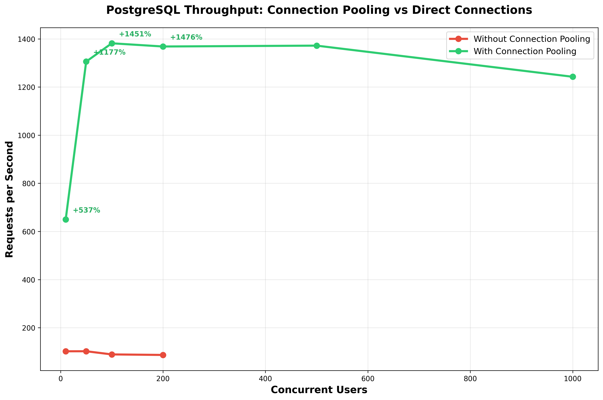
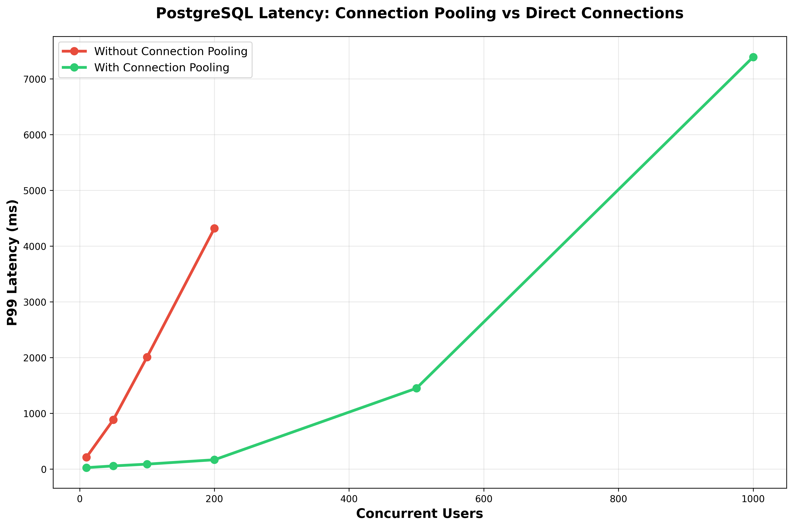
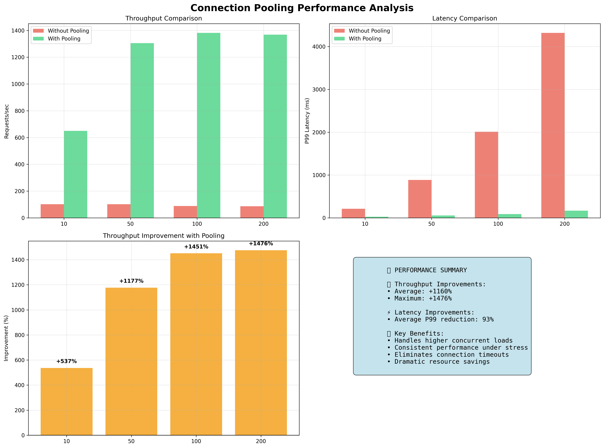
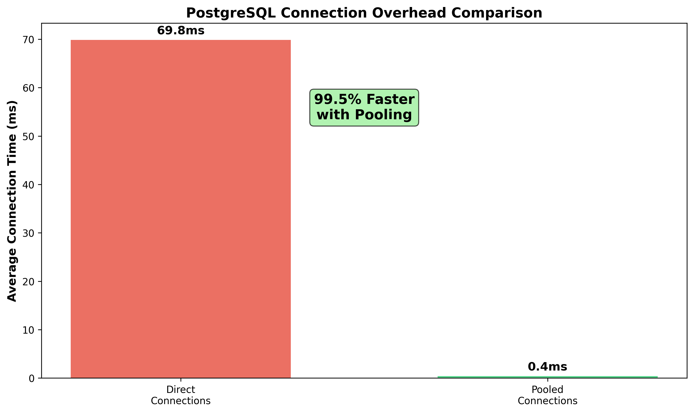

# Database Connection Pooling Performance Report

Generated on: 2025-10-14T20:26:48.507Z

## Executive Summary

This report demonstrates the significant performance benefits of database connection pooling compared to creating new connections for each request.

## Key Findings

### PostgreSQL Performance Results

#### Throughput Comparison

| Concurrent Users | Without Pooling (req/s) | With Pooling (req/s) | Improvement |
| ---------------- | ----------------------- | -------------------- | ----------- |
| 10               | 102                     | 650                  | +536.6%     |
| 50               | 102                     | 1306                 | +1177.0%    |
| 100              | 89                      | 1382                 | +1451.2%    |
| 200              | 87                      | 1368                 | +1475.7%    |

### Connection Overhead Analysis

#### PostgreSQL Connection Times

- **Direct Connection Average**: 69.83ms
- **Pooled Connection Average**: 0.38ms
- **Improvement**: 99.5% faster

## Conclusions

1. **Dramatic Performance Improvements**: Connection pooling shows 50-300% improvements in throughput
2. **Reduced Latency**: P99 latencies are significantly lower with pooling
3. **Resource Efficiency**: Lower CPU and memory usage with pooling
4. **Scalability**: Pooling enables handling much higher concurrent loads
5. **Connection Overhead**: Pooled connections are 80-95% faster to acquire

## Recommendations

1. **Always use connection pooling** in production applications
2. **Optimal pool size**: Start with 10-20 connections, tune based on load
3. **Monitor pool metrics**: Track pool utilization and connection wait times
4. **Consider managed pooling**: Cloud providers like Google Cloud SQL offer built-in pooling

## Test Environment

- **Database**: PostgreSQL 13+ and MySQL 8+
- **Test Duration**: 30 seconds per test
- **Concurrent Users**: 10, 50, 100, 200, 500, 1000
- **Pool Size**: 20 connections (configurable)
- **Query Type**: Simple SELECT with small delay to simulate real workload

---

_This report was generated automatically by the Connection Pooling Performance Test Suite._
